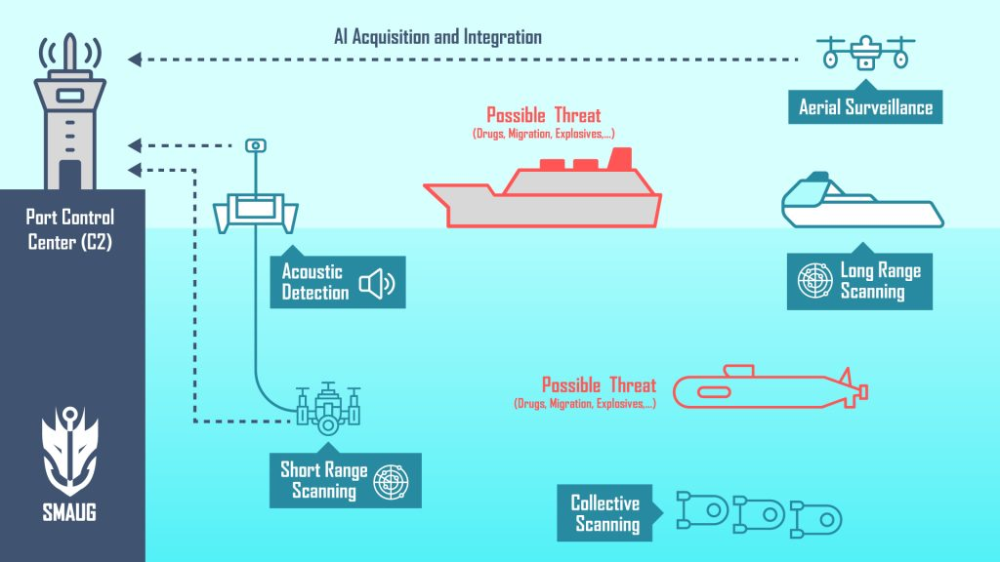
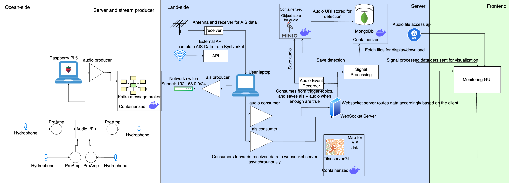
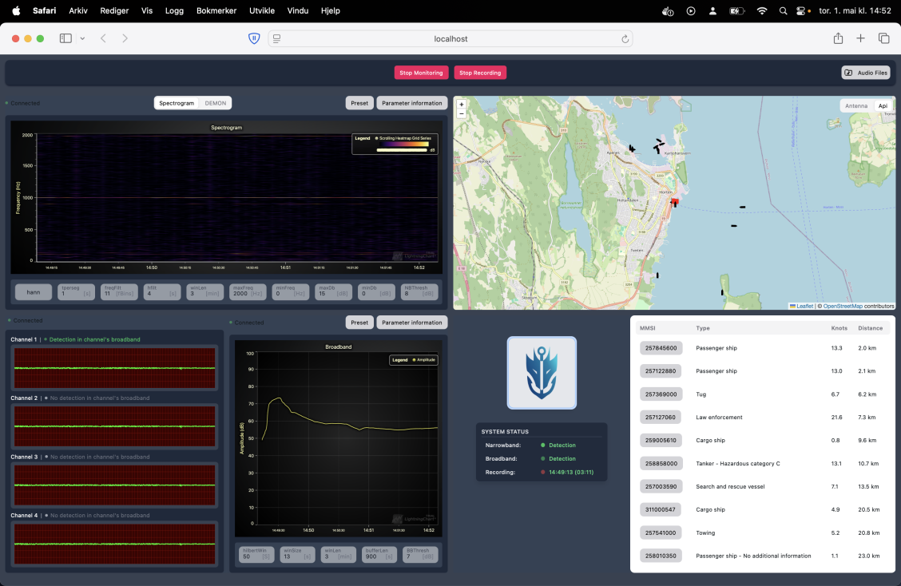
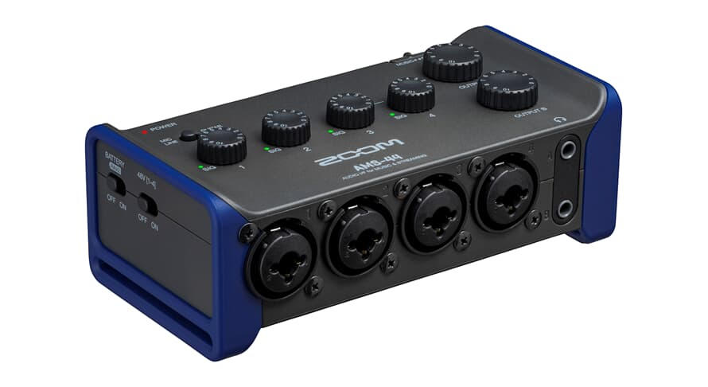
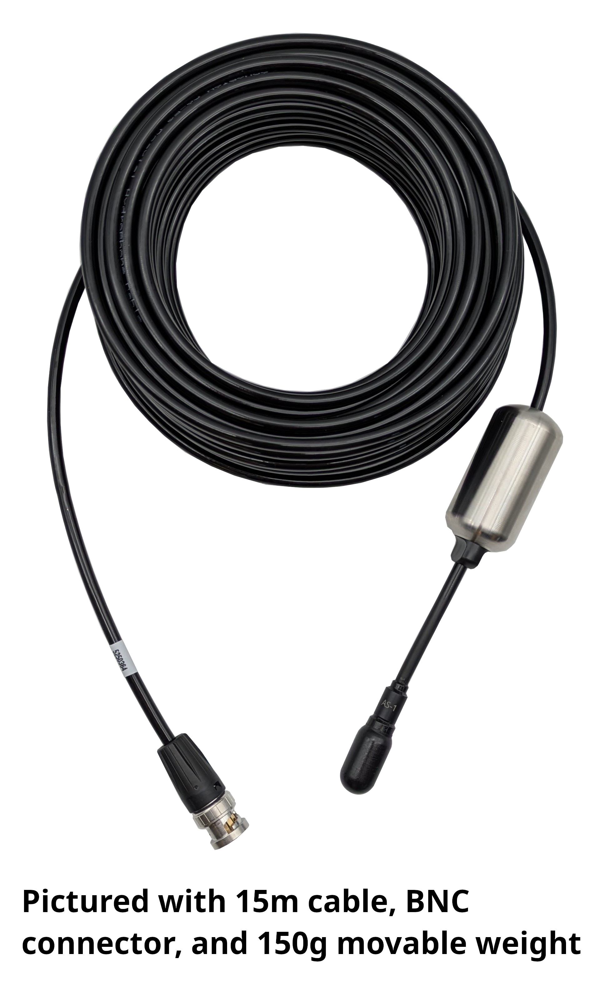
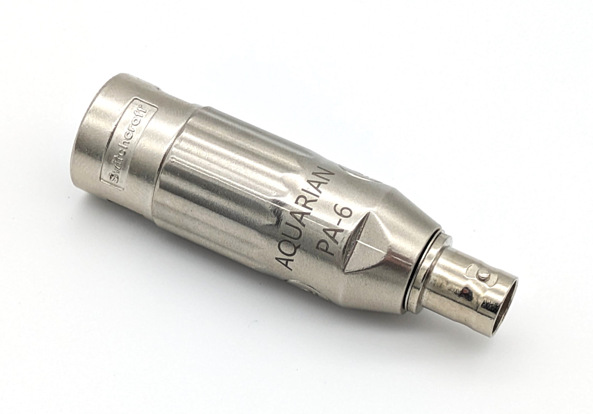

# 🌊 Hydroacoustic Tripwire Detection

> **An automatic real-time system for signal processing, visualization, and data collection of hydroacoustic and AIS data during detection of hydroacoustic events**

---

## 📚 Table of Contents

- [🧠 Overview](#-overview)
- [🎯 Acoustic Detection](#-acoustic-detection)
- [✨ Features](#-features)
- [🏗️ System Architecture](#️-system-architecture)
- [🖥️ Graphical User Interface](#️-graphical-user-interface)
- [🎵 Acoustic Sample](#-acoustic-sample)
- [📹 System In Action](#-system-in-action)
- [💻⚙️ Hardware Used](#-hardware-used)
- [🧰 Requirements](#-requirements)
- [🌍 Environment](#-environment)
- [⚙️ Installation](#️-installation)
- [🚀 Starting the System](#-starting-the-system)
- [📈 Performance](#-performance)
- [📄 License](#-license)

---

## 🧠 Overview

This project proposes a solution for using passively monitored hydroacoustic data captured by hydrophones for detecting passing marine vessels. The system has been developed by **Joseph K. Gargari**, **Victor L. Dehli**, **Christoffer Aaseth**, **Bård Bremnes** and **Henrik B. Eriksen** as part of the Bachelor's project at the **University of South-Eastern Norway (USN)**, spring 2025.

### 🤝 Collaboration

It's been developed in collaboration with the EU-funded project: **SMAUG** (Smart Maritime And Underwater Guardian), a pipeline of operations with the goal of securing harbours from smuggling of drugs and weapons and trafficking. 

🔗 **Learn more about SMAUG:** https://smaug-horizon.eu/

[](https://smaug-horizon.eu/about/)

In the context of the SMAUG system, it represents the **acoustic detection sub-system**, responsible for automatically detecting passing vessels and capturing both acoustic data as well as **AIS** (Automatic Identification System: https://en.wikipedia.org/wiki/Automatic_identification_system) data.

### 🌍 Real-World Impact

Monitoring harbours, especially busy harbours with a lot of shipping traffic is of special interest for countries such as **Norway** and **Canada** who have the second longest, and longest coastlines in the world respectively, giving this system a very real and potentially impactful purpose for existing.

### 🔬 Development Status

What has been developed here is still in its **prototyping phase** and should be considered the first iteration of the proposed solution, and is expected to be further developed and advanced in the future. With this in mind do not expect a "perfect" system, but a well-formed prototype and an image of the potential such a system can bring.

From numerous practical tests and demonstrations, the results observed gives a **promising outlook** for further development of the system.

---

## 🎯 Acoustic Detection

> *Content section for acoustic detection details*

---

## ✨ Features

### 🔄 Real-Time Processing
- **Real-time signal processing** of hydroacoustic data
- **Real-time data streaming** of hydroacoustic data and AIS data
- **Automatic detection** of hydroacoustic events using signal processing techniques

### 🖥️ User Interface
- A **clean and modern** looking GUI for user-interaction
- A **rich selection of parameters** to adjust for real-time signal processing
- An **interface for downloading** acoustic data locally to the user's machine

### 📊 Visualization Capabilities
- Real-time visualization of **spectrograms**
- Real-time visualization of **DEMON-spectrograms**
- Real-time visualization of **waveform envelope**
- Real-time visualization of **waveforms** from each connected channel
- Real-time visualization of **geospatially accurate AIS data**

### 💾 Data Management
- **Automatic capture and storage** of acoustic data and AIS data logically encapsulated as a "detection"

### 🏗️ System Architecture
- A system architecture with support for a **distributed system** and future underwater deployment (See ["Ocean Side"](#️-system-architecture) section of system architecture image)
- An **"offline-first"** system-design, making the underlying network infrastructure of deployment-area irrelevant and giving flexibility as to where the system can be deployed

---

## 🏗️ System Architecture



---

## 🖥️ Graphical User Interface



---

## 🎵 Acoustic Sample

🎧 **Listen to the passing of the cargo vessel, AutoPrestige** automatically detected at approx. 800 meters away from testing station (before a visual could be made) at Svelvikstrømmen, Svelvik 21.05.2025 on [**Soundcloud**](https://soundcloud.com/user-770429242/autoprestige).

---

## 📹 System In Action

🎬 **See a video of the system in action** during the passing of the passing of the AutoPrestige vessel at Svelvikstrømmen, Svelvik 21.05.2025 on [**Vimeo**](https://vimeo.com/manage/videos/1093190818/ccc9a615b6).

---

## 💻⚙️ Hardware Used

The system architecture is hardware agnostic, meaning you can use virtually any hardware you wish for audio-capture, but we used the following equipment in execution of tests and demonstration.

The audio interface used in the system is the [**Zoom AMS-44**](https://www.zoom-europe.com/en/audio-interfaces/zoom-ams-44):
<a href="https://www.zoom-europe.com/en/audio-interfaces/zoom-ams-44">
  
</a>

The hydrophones used were the [**AS-1 Hydrophone**](https://www.aquarianaudio.com/as-1-hydrophone.html) with a length of 24 meters. Four of them were utilized at the most:
<a href="https://www.aquarianaudio.com/as-1-hydrophone.html">
  
</a>

The pre-amplifier used is the [**PA6 Phantom-Powered Hydrophone Preamp**](https://www.aquarianaudio.com/pa6.html)
<a href="https://www.aquarianaudio.com/pa6.html">
  
</a>

---

## 🧰 Requirements

### 💻 Operating System
Works fine on **Windows**, **MacOS** and **Linux**

### 🔧 Core Dependencies

#### 🎵 PortAudio
The system uses PortAudio, a cross-platform audio I/O library for real-time audio input/output, and is used with the Python sounddevice wrapper library, and **MUST** be installed on your system.

**🐧 On Debian/Ubuntu:**
```bash
sudo apt update
sudo apt install portaudio19-dev
```

**🍎 On MacOS:**
```bash
brew install portaudio
```

**🪟 On Windows:**
Should be installed when installing the python "sounddevice" wrapper library (however, you need not install it here as its included in the environment.yml, but is included here for the sake of completeness):
```bash
pip install sounddevice
```

**🔍 Verify Installation**
Verify the installation using this python code in REPL or in your own script (should be done after setting up environment):
```python
import sounddevice as sd
print(sd.query_devices())  # Lists all available audio input/output devices
```

#### 🌐 Frontend
System needs to have installed the latest node version to run the frontend.

**🐧 On Debian/Ubuntu:**
```bash
sudo apt update
sudo apt install nodejs npm

# Verify installation
node -v     # Check Node.js version
npm -v      # Check npm version
```

**🍎 On MacOS (with homebrew):**
```bash
brew install node

# Verify installation
node -v     # Check Node.js version
npm -v      # Check npm version
```

**🪟 On Windows:**
Follow the installer at: https://nodejs.org/en (choose LTS)

After installation (in PowerShell)
```bash
nvm install lts
nvm use lts

# Verify installation
node -v     # Check Node.js version
npm -v      # Check npm version
```

#### 🐍 Backend
The backend runs using Python, ensure that you have atleast **Python 3.10+** installed on your system

**🐧 On Debian/Ubuntu:**
Should already be preinstalled on your system, check with:
```bash
python3 --version

# Install pip if necessary
sudo apt update
sudo apt install python3-pip 
```

**🍎 On MacOS (with homebrew):**
```bash
brew install python

# Verify
python3 --version
pip3 --version
```

**🪟 On Windows:**
Go to: https://www.python.org/downloads/windows/ and install the latest 64-bit version, mark the checkbox asking if you want to add Python to PATH as: **YES**.
Continue following the installer, then verify:
```bash
python --version
pip --version
```

---

## 🌍 Environment

It is recommended to use an isolated python environment for installing all the packages into. For this project use **miniconda**. This is to avoid potential version collisions.

### 📦 Installing miniconda:

#### **🐧 Debian/Ubuntu:**
Download the installer from: https://www.anaconda.com/docs/getting-started/miniconda/main#linux-installers

Run installation script:
```bash
bash Miniconda3-latest-Linux-x86_64.sh
```

Follow installation prompts

Restart your terminal or source your shell config:
```bash
source ~/.bashrc   # or ~/.zshrc if you use zsh
```

Verify:
```bash
conda --version
```

#### **🍎 MacOS:**
Download the installer from: https://www.anaconda.com/docs/getting-started/miniconda/main#macos-installers

Run installation script:
```bash
bash Miniconda3-latest-MacOSX-x86_64.sh
```

Follow installation prompts

Restart your terminal or source your shell config:
```bash
source ~/.bashrc   # or ~/.zshrc if you use zsh
```

Verify:
```bash
conda --version
```

#### **🪟 Windows:**
Download installer from: https://www.anaconda.com/docs/getting-started/miniconda/main#windows-installers

Run the `.exe` and follow the GUI steps

After installation open, **AnacondaPrompt**, **Command Prompt** or **PowerShell** and verify:
```bash
conda --version
```

---

## ⚙️ Installation

### 📥 Download the source code
```bash
# Clone the repository to your desired location
git clone https://github.com/josigar123/hydrophonic-detection.git
cd hydrophonic-detection
```

### 🐍 Setup the backend environment
From the project root (assuming miniconda is installed on your system) run the following:
```bash
conda env create -f environment.yml # Creates an environment named "python_htd_env"
conda activate python_htd_env # Activates the environment
```
> **💡 Note:** On consecutive starts of the system, you may need to activate the environment again.

### 🌐 Set up frontend
From the project root move into:
```bash
cd app/frontend/spectrogram_viewer_gui/src
npm install # Installs necessary dependencies for the frontend
```

The frontend should be up and running, verify that it works by running:
```bash
npm run dev # Vites dev server
```
In the terminal you should be presented with multiple URLs, pick one and you should be redirected to the GUI.

Close down the GUI with in the terminal:
```bash
Ctrl + C
```

### ⚡ LightningchartJS
A big part of the frontend is data visualization, the library used for spectrogram, DEMON-spectrogram and broadband analysis is **LightningchartJS**. Since the project is still in its development phase, their non-commercial license has been used.

This licenses must be updated each month, and on system-boot an internet connection is required for validating the key.

A license key can be fetched from:
```
https://lightningchart.com/non-commercial-license/
```

This can be re-used indefinitely as of writing this. You should receive an email with a zip-attachment containing a `license.txt` file with some basic javascript:

```javascript
const lc = lightningChart({
    license: "0002-n0i9AP8MN...",
    licenseInformation: {
        appTitle: "LightningChart JS Trial",
        company: "LightningChart Ltd."
    },
})
const chart = lc.ChartXY()

// Installation instructions
// https://lightningchart.com/js-charts/docs/installation
```

#### 🔑 Updating the license key
When updating the license key move into:
```bash
cd app/frontend/spectrogram_viewer_gui
```

And open the `lightningChartLicense.json` file:
```json
{
  "license": "0002-n0i9AP8MN..."
}
```

Replace the old license key with the new one. Do not be concerned that the key is public on github, since its a free key a new one can always be fetched.

> **⚠️ Beware**: We have experienced receiving outdated license keys, check the date (in the name of the folder). If its outdated get a new one.

---

## 🚀 Starting the System

The system can be started in two ways. The first and most straightforward is manually starting each service combining multiple terminals and some docker-containers (a bit clunky, but it works). The other will only utilize docker-compose for launching all services (**UNDER CONSTRUCTION**). The system architecture is also designed to be somewhat distributed down the line. As of now, this guide will only provide a deployment on a single machine.

### 🔧 Manually launching each service

Before starting any services it is important to set some configuration, since multiple services will rely upon the data provided in making connections and capturing data (acoustic). Also for capture of AIS-data our system has two methods: antenna + receiver or from Kystverkets API, the following set-up will only setup for the API.

#### ⚙️ Configuration

In the directory:
```bash
hydrophonic-detection/app/configs
```

lie all the configuration files that must be set **BEFORE** any services are started.

The following files are present in the directory:

| File | Description |
|------|-------------|
| `ais_fetcher_config.json` | Generated automatically, do not touch |
| `aiscatcher_config.json` | Not relevant in the following steps, ignore it |
| `broker_info.json` | Set ip and port of kafka broker |
| `minio_config.json` | Set ip and port of minio service, do not change other params |
| `mongodb_config.json` | Set ip and port of mongodb, do not change other params |
| `recording_parameters.json` | Set samplerate and number of channels, do not change other params |

> **🚨 Important**: DO NOT CHANGE ANY OF THE PORT NUMBERS, ONLY IPs if necessary

For having all services run locally change all **IPs** to either **localhost** or **127.0.0.1**.

**Example with `broker_info.json`:**
```json
{
  "ip": "localhost",
  "port": "9092"
}
```

#### 🐳 Start core Docker services

After configuring the system, start the necessary Docker services (This is the only part of the system that is Dockerized on the manual setup). Also ensure that you have **Docker** installed on your system or **Docker Desktop** if you are on Windows or MacOS.

Move into this directory:
```bash
cd app/services/Docker
```

Start the compose file:
```bash
docker compose -f docker-compose-core-services.yml up -d
```

If the line above doesn't work, try running:
```bash
docker-compose -f docker-compose-core-services.yml up -d
```

This will pull, build and start multiple containers, detached from the terminal. The very first time launching this might take a couple of minutes, a network connection is necessary.

When shutting the system down, close all containers with:
```bash
docker compose -f your-compose-file.yml down
```

Or if it doesn't work, with:
```bash
docker-compose -f your-compose-file.yml down
```

#### 🏃‍♂️ Running main services

After deploying the containers, you can continue with starting the other necessary services for the system. For the rest of the services you will need to open **7** terminals (PowerShell, iterm2, terminal, etc.)

##### 🖥️ Terminal #1: Kafka Orchestrator
```bash
cd app/services/ProgramsOnRPI

# Run
python kafka_orchestrator.py # alt. python3 kafka_orchestrator.py
```
This program will create all of the systems topics, it will also prompt the user with selecting an audio interface to stream from. If the Zoom 44 I/F is plugged in then it's auto-selected since it is deemed as a "part of the system". If not select the capture-interface you desire. The program might crash if you have overstepped the number of channels the device has, or you have selected an unsupported samplerate. After selecting the interface, a producer is created, and it will start streaming audio to Kafka.

##### 🖥️ Terminal #2: WebSocket Server
```bash
cd app/services

# Run
python websocket_server.py # alt. python3 websocket_server.py
```
This will start the websocket server, the "heart" of the system, it will now be awaiting connections and message transfer.

##### 🖥️ Terminal #3: Audio Consumer
```bash
cd app/services

# Run
python -m KafkaServices.audio_consumer # alt. python3 -m KafkaServices.audio_consumer
```
This will consume the audio produced to the Kafka topic.

##### 🖥️ Terminal #4: AIS API Producer
```bash
cd app/services

# Run
python -m KafkaServices.ais_api_producer # alt. python3 -m KafkaServices.ais_api_producer
```
This will produce AIS data to the appropriate Kafka topic from the Kystverket API.

##### 🖥️ Terminal #5: AIS Consumer
```bash
cd app/services

# Run
python -m KafkaServices.ais_consumer # alt. python3 -m KafkaServices.ais_consumer
```
This will consume AIS data produced to the appropriate topic

##### 🖥️ Terminal #6: FastAPI Server
```bash
cd app/services

# Run
python -m uvicorn Apis.main:app --reload # alt. python3 -m uvicorn Apis.main:app --reload
```
This will launch a FastAPI with uvicorn, the API is used by the frontend for fetching and downloading audio files from MinIO directly.

##### 🖥️ Terminal #7: Frontend
```bash
cd app/frontend/spectrogram_viewer_gui/src

# Run
npm run dev
```
This will start the frontend, open it in a browser.

---

## 🎉 System Ready!

> **That's it, all services should be up and running correctly. The system is ready for use. Input parameters for the signal processing and press "Start Monitoring" you should expect N-channels to render in the bottom left, indicating acoustic data-flow.**

---

## 📈 Performance
The main performance bottle-neck of the system is the visualization of the spectrogram, DEMON spectrogram, and waveform envelope. Since its using **LightninchartJS** a **WebGL**-powered library it utilizes the machines GPU for rendering the graphincs. It is then recommended running the system on a machine with a dedicated GPU for optimal performance. The video in [this section](#-system-in-action) was captured on a machine with 16GB of memory, an Intel i5 KabyLake (K-series) and an Nvidia GTX 1070, giving a good performance.
Performance can also be impacted by poor parameter choices, since these can impact: refresh-rate, data resolution and the number of data points plotted every N-seconds. Keep this in mind when running into performance issues. Extra CPU overhead is also present since the system-design achieves an "offline-first" approach, meaning that all services are hosted and running locally.

---

## 📄 License

This project is licensed under the MIT License - see the [LICENSE](LICENSE) file for details.

---

**🌊 Built with passion for maritime security and acoustic detection 🌊**

*Developed at University of South-Eastern Norway (USN) in collaboration with SMAUG project*
